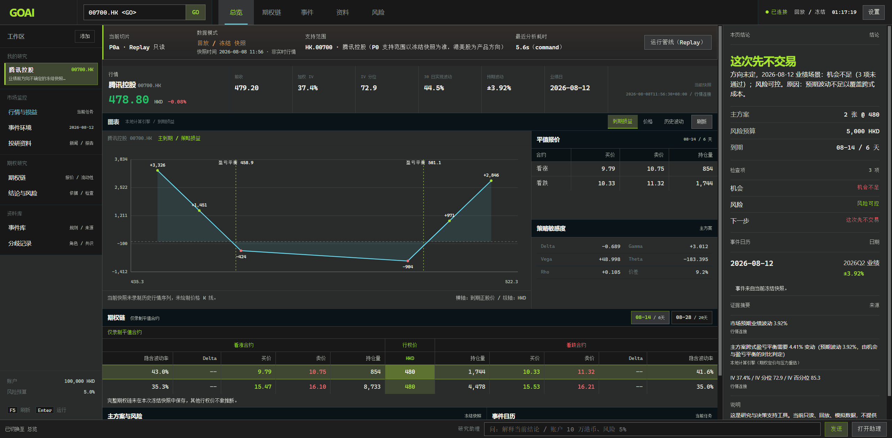
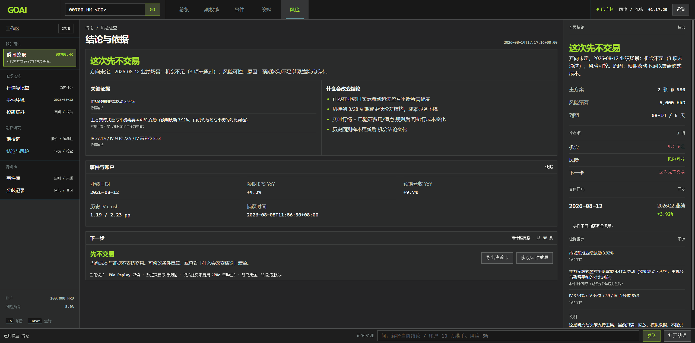
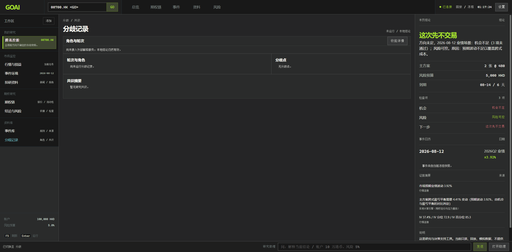
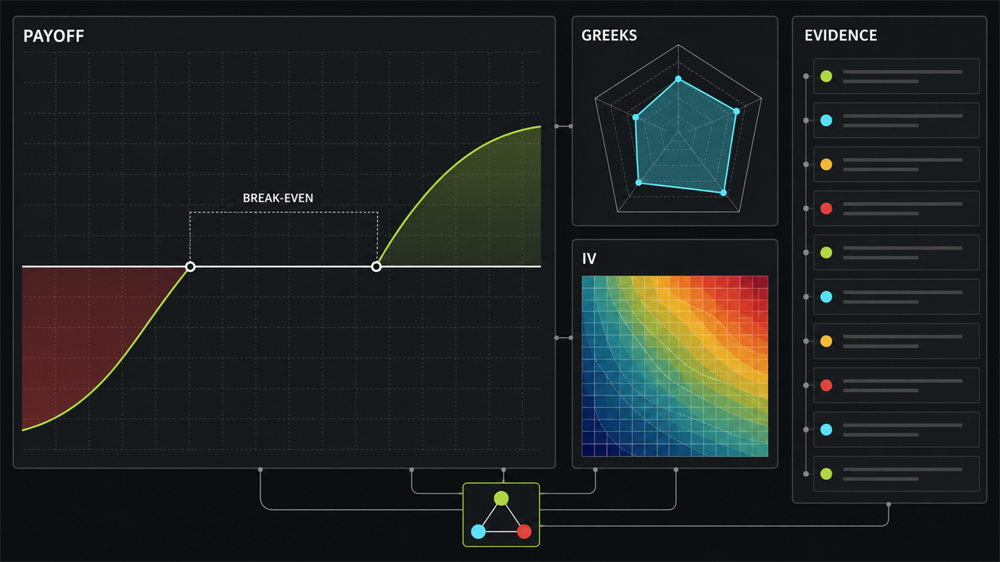
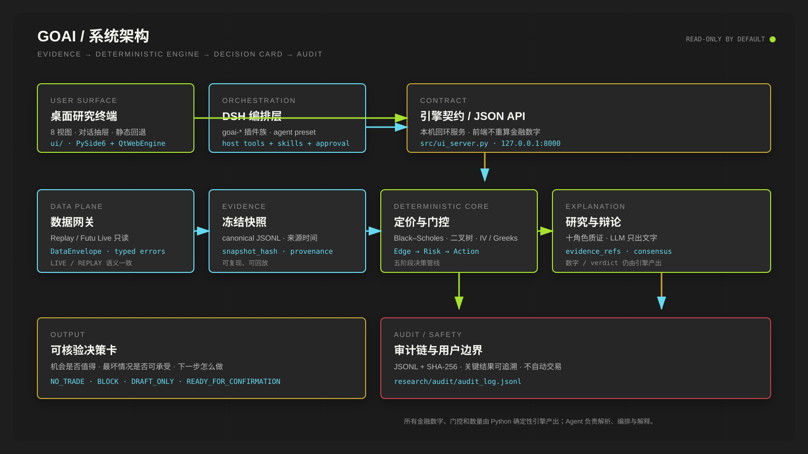
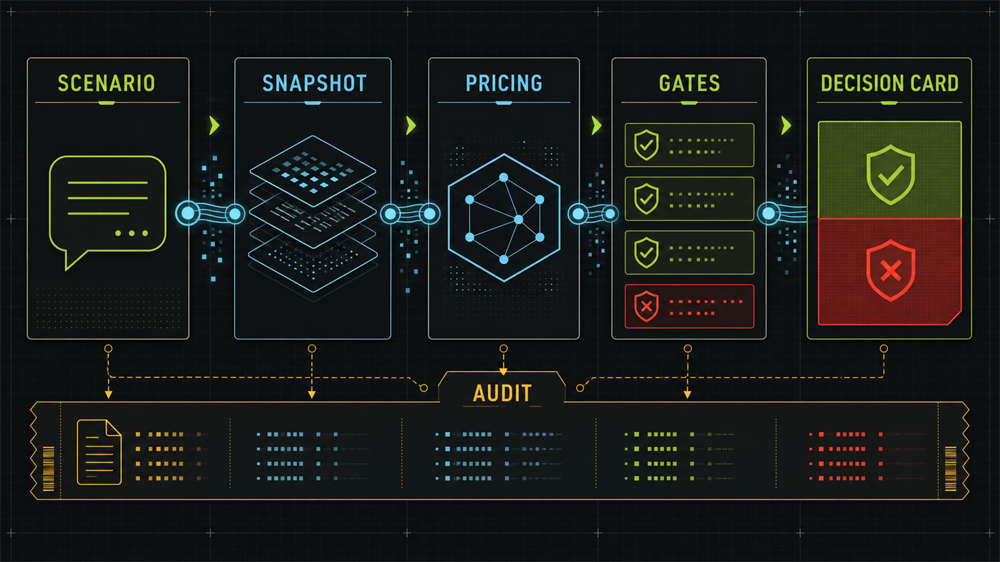
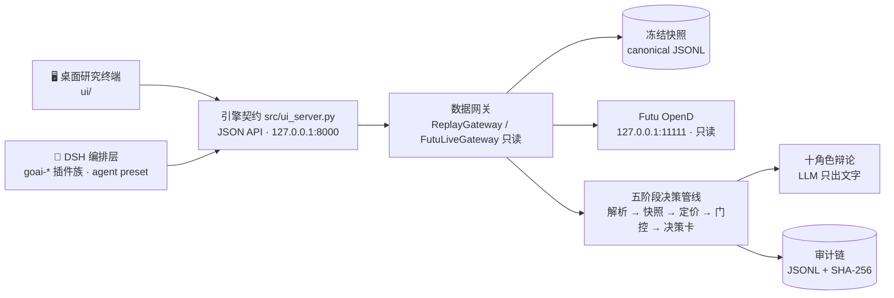

<div align="center">

# GOAI · 港美股期权智能投研终端

**把自然语言期权观点，变成一张带数据来源、定价依据、账户风控与审计链的可核验决策卡。**


</div>

## 📖 目录

- [项目简介](#-项目简介)
- [功能说明](#-功能说明)
- [架构概览](#-架构概览)
- [安装步骤](#-安装步骤)
- [使用方法](#-使用方法)
  - [独立模式（不依赖 DSH）](#独立模式不依赖-dsh评审可用)
  - [DSH 模式（对话 Agent 编排）](#dsh-模式对话-agent-编排)
  - [十角色辩论运行时](#十角色辩论运行时llm-只出文字数字仍来自自研引擎)
- [测试与质量](#-测试与质量)
- [项目结构](#-项目结构)
- [核心原则](#-核心原则)
- [边界与安全](#-边界与安全)
- [贡献指南](#-贡献指南)
- [许可证](#-许可证)
- [免责声明](#-免责声明)
- [相关文档](#-相关文档)

## ✨ 项目简介

GOAI 是 **GOAI 世界人工智能开源大赛 · Boundless Agents（无界应用）· 金融服务赛道** 的参赛项目，面向有基础期权认知的用户：把自然语言表达的观点，转成带数据来源、港股产品规则、确定性定价、账户风控和审计记录的**决策卡**。

产品定位是**研究与决策支持**，不是投资建议，不提供实盘自动交易。

> **Hero 场景**：腾讯 `HK.00700` 业绩前方向不确定，账户 10 万港币，评估长跨式是否值得交易。

<p align="center">
  
</p>

> 视觉说明：主视觉、管线图和数据板是 Image 2 生成的品牌化设计示意，不代表实时行情或投资收益；终端截图来自仓库已有的 Replay 端到端证据。

系统针对每个场景输出四种产品结果之一：

| 结果码 | 含义 |
|---|---|
| `NO_TRADE` | 当前成本和证据不支持交易 |
| `BLOCK` | 数据、规格、账户或风险硬门未通过 |
| `DRAFT_ONLY` | 可研究和生成草稿，但不能提交 |
| `READY_FOR_CONFIRMATION` | 客观门通过，可由用户确认 Futu 模拟方案 |

> `NO_TRADE` 是成功结果。系统不会为了展示下单而调低门槛。

**项目形态：一个运行在 DeepSeek Harness（DSH）上的「大号金融插件」。** Python 确定性引擎守护全部金融数字与审计链，DSH 负责 Agent 编排、工具注册、人机审批与对话体验。评审也可以完全不装 DSH，用 `python -m src.ui_server` 独立运行——两条入口共享同一引擎契约。架构权威文档见 [docs/DSH_ARCHITECTURE.md](docs/DSH_ARCHITECTURE.md)。

## 🚀 功能说明

### 确定性引擎与审计

- **五阶段端到端决策管线**：场景解析 → 冻结快照 → 自研定价引擎 → Edge/Risk/Action 门控 → 可溯源决策卡 + 审计留痕（`src/decision_pipeline.py`）；
- **自研定价引擎**：Black–Scholes、通用美式二叉树、IV 求解、bump-and-reprice Greeks；港股离散股息 escrowed-spot 定价口径已进入引擎 / IV / Greeks / 管线全链路；
- **港股产品规格解析与模型路由**：区分美式/欧式、周选/月选、实物/现金交割等市场差异；
- **JSONL + SHA-256 审计链**：决策卡、辩论结论、会话度量全程留痕，可校验、可导出（`GET /api/decision-card`）。

### 数据层

- **SDK 无关的 typed Gateway 合同**：稳定快照哈希、typed error、`DataEnvelope` 统一 LIVE/REPLAY 语义；
- **双 Gateway**：Futu Live 只读行情/账户 Gateway 与同合同的确定性 Replay Gateway（不导入 Futu SDK）；
- **线程安全 Snapshot Recorder**：严格 JSONL 校验与 legacy 快照迁移读取；
- **实时行情两个阶段**：`GOAI_DATA_MODE=live` 只读报价链路（OpenD 不可用显式报 `OPEND_UNAVAILABLE`，绝不静默回退 Replay）；`GET /api/stream` SSE 推送/订阅（默认 2s diff 轮询，`GOAI_LIVE_FEED=push` 走真实 OpenD 订阅，失败自动回退并推 `warning` 事件）；
- **多标的项目工作区**（`data/workspaces.json`）：为不同公司分别绑定期权快照、历史行情与投研资料，切换项目后整条研究管线跟随。

### Agent 编排（DSH）

- **Cordis 插件族**：Base Mode（`goai-core` + `goai-run` + `goai-chat`）保证基本使用，`goai-macro` / `goai-research` / `goai-backtest` 为可选插件，用户在 `harness/config/goai.plugins.json` 勾选；
- **GOAI Options Terminal agent preset**：一键挂载产品人格、铁律与工作流；
- **十角色多 Agent 辩论运行时**：LLM 只出文字，数字/verdict 仍由引擎产出，离线自动回退；
- **项目级 `futu-options-agent` 工作流**：`goai_*` tools 可用时优先走 DSH 工具。

### 研究支持

- **投研证据整理与影响研判**：公告 / 财报 / 新闻 / 研报 / 行业数据 → 股价与期权影响；Futu 新闻/公告/研报适配器只做格式转换与来源留痕，不虚构时间与标题；
- **宏观研判**：情绪量化 + IV 情绪晴雨表 + 政策事件库 + 政治经济学 + 求是检验（只输出定性可能性级别，不产生概率）；
- **政策事件库 + 宏观来源自动监控**：美联储/ECB 官方 RSS、FRED、BLS、SEC EDGAR 与中国官方 HTML 来源，DRAFT 入库 → 复核 → promote ACTIVE，Windows 计划任务已注册；
- **知识库检索**：中英别名检索 46+ 结构化来源（`research/kb_search.py`）；
- **腾讯业绩跨式历史回测原型**。

### 研究终端

8 视图桌面研究终端（总览 / 决策卡 / 期权链 / 宏观 / 投研 / 政策库 / 分歧 / 审计），Bloomberg 式深色设计语言，支持对话抽屉、项目工作区、`Ctrl+K` 研究助理、实时推送状态徽章与静态回退。

<p align="center">
  
</p>

<table>
  <tr>
    <td width="50%"></td>
    <td width="50%"></td>
  </tr>
  <tr>
    <td align="center">决策卡：机会、风险与下一步集中呈现</td>
    <td align="center">辩论视图：分歧点、证据引用与研究共识</td>
  </tr>
</table>

<p align="center">
  
</p>

数据板是产品信息架构的视觉示意：把收益曲线、Greeks、IV 与证据来源放在同一研究面上；真实数字仍以冻结快照和确定性引擎输出为准。

### 当前状态

| 能力 | 说明 | 状态 |
|---|---|---|
| P0a Replay 决策链路 | 冻结快照 → 决策卡 → 审计链 | ✅ 已毕业 |
| P0b Live 只读行情 | 第一阶段报价 + 第二阶段 SSE 推送/订阅 | ✅ 已毕业 |
| 港股离散股息定价口径 | escrowed-spot 口径全链路（快照 `model.dividends` 可选声明） | ✅ 已完成 |
| executable-cost 完整口径 | 费用 / 滑点 / 持仓限额 / 单笔上限链（快照 `account.cost_policy` / `account.trade_limits` 可选声明，三层口径 VERIFIED/SNAPSHOT_DECLARED/UNVERIFIED） | ✅ 已完成 |
| 独立 Edge/Risk/Action gates | 三道门独立化 | 🚧 建设中 |
| P0c 模拟提交闭环 | `READY_FOR_CONFIRMATION` → 确认语人机确认 → Futu SIMULATE 下单 → 回执入审计链（`POST /api/submit`，需 `GOAI_TRADE_ACCOUNT_ID` 配置模拟盘账户；实盘双重硬阻断、无 SDK 解锁） | ✅ 已完成 |
| DSH 客户端决策卡面板 + 审批闭环 | Phase 1a | 🚧 建设中 |
| 港股离散股息 Live 实时富化 | 引擎已支持快照声明的离散股息，实时富化待接入 | 🚧 建设中 |

完整产品边界与验收标准见 [精简版 PRD](docs/PRD.md)（v0.8）。

## 🏗️ 架构概览

<p align="center">
  
</p>

五阶段流程的视觉摘要：

<p align="center">
  
</p>



一句话流程：

```text
DSH 编排层（host 插件 + model tools + skills + preset）
        → 引擎契约（ui_server JSON API，127.0.0.1:8000）
        → Python 引擎（数值铁律：gateway / pricing / pipeline / debate / audit）
```

## 📦 安装步骤

### 环境要求

| 依赖 | 版本 | 说明 |
|---|---|---|
| Windows | 10 / 11 | 开发与演示环境 |
| Python | 3.13 | 推荐使用项目级虚拟环境 |
| Futu OpenD | 本地安装并登录 | 可选：仅 `GOAI_DATA_MODE=live` 实时行情需要 |
| DeepSeek API Key | — | 可选：未配置时辩论自动离线确定性回退，Demo 不崩 |

### 安装

```powershell
# 1. 克隆仓库
git clone https://github.com/Alyosha28/GOAi_competition.git
cd GOAi_competition

# 2. 创建并激活虚拟环境
python -m venv .venv
.\.venv\Scripts\Activate.ps1

# 3. 安装核心依赖
pip install -r requirements.txt

# 4.（可选）桌面壳（PySide6 + QtWebEngine）
pip install -r requirements-desktop.txt

# 5.（可选）历史行情与 30 日实现波动率（OpenBB / yfinance）
pip install -r requirements-openbb.txt

# 6.（可选）配置 LLM 辩论运行时
Copy-Item .env.example .env   # 然后编辑填入 DEEPSEEK_API_KEY
```

### 环境变量

完整配置见 [.env.example](.env.example)（`.env` 已 gitignore，密钥不入库；进程环境变量优先于 `.env`）。

| 变量 | 必填 | 默认值 | 说明 |
|---|---|---|---|
| `DEEPSEEK_API_KEY` | 否 | 空 | DeepSeek OpenAI 兼容接口密钥；未配置自动离线回退 |
| `DEEPSEEK_BASE_URL` | 否 | `https://api.deepseek.com/v1` | 可替换为其他兼容服务商 |
| `GOAI_CHAT_MODEL` | 否 | `deepseek-chat` | 普通分析角色模型 |
| `GOAI_REASONER_MODEL` | 否 | `deepseek-reasoner` | 主席与宏观/风险/审计角色模型 |
| `GOAI_CHAT_TIMEOUT_S` | 否 | `30` | 对话模型超时（秒） |
| `GOAI_REASONER_TIMEOUT_S` | 否 | `90` | 推理模型超时（秒） |
| `GOAI_LLM_RETRIES` | 否 | `2` | 5xx/429/瞬时网络错误重试（401/403 不重试） |
| `GOAI_LLM_RETRY_BACKOFF_S` | 否 | `0.5` | 重试退避（秒） |
| `GOAI_OPENBB_ENABLED` | 否 | `1` | 历史价格与实现波动率 provider 开关 |
| `GOAI_OPENBB_PROVIDER` | 否 | `yfinance` | 历史行情 provider |
| `GOAI_OPENBB_PERIOD` | 否 | `2y` | 历史行情区间 |
| `GOAI_RESEARCH_ITEMS_PATH` | 否 | `data/research_items_hero.json` | 投研资料源（canonical JSON） |
| `GOAI_DATA_MODE` | 否 | `replay` | `replay`（冻结快照）/ `live`（只读实时） |
| `GOAI_LIVE_FEED` | 否 | `poll` | `poll`=2s diff 轮询 / `push`=真实 OpenD 订阅推送 |
| `GOAI_LIVE_STREAM_POLL_SECONDS` | 否 | `2.0` | SSE 轮询间隔 |
| `GOAI_LIVE_STREAM_PUSH_SILENCE_SECONDS` | 否 | `60.0` | 推送静默判定阈值 |
| `GOAI_LIVE_STREAM_MAX_SUBSCRIBERS` | 否 | `8` | SSE 订阅上限 |
| `GOAI_TRADE_ACCOUNT_ID` | 否 | 无 | P0c 模拟提交所需：Futu 模拟盘账户 ID（未配置时 `/api/submit` 返回 503） |
| `GOAI_TRADE_CURRENCY` | 否 | `HKD` | 模拟盘账户币种 |
| `GOAI_TRADE_SECURITY_FIRM` | 否 | `FUTUSECURITIES` | 模拟盘证券商（比赛版本仅 FUTUSECURITIES） |

## 🎯 使用方法

### 独立模式（不依赖 DSH，评审可用）

**端到端决策管线**（无需 OpenD，使用冻结快照）：

```powershell
python -m src.decision_pipeline
```

输出 `data/decision_card_*.json` 与 `research/audit/audit_log.jsonl` 哈希链记录。

**8 视图研究终端**（总览 / 决策卡 / 期权链 / 宏观 / 投研 / 政策库 / 分歧 / 审计，含十角色辩论 dock）：

```powershell
python -m src.ui_server --port 8000
```

访问 `http://127.0.0.1:8000/`。对话面板输入自然语言（`POST /api/chat`）直接驱动「场景解析 → 五阶段管线 → 十角色辩论」；无 DeepSeek key 自动离线回退，Demo 不崩。

只读 API 一览：

| 端点 | 说明 |
|---|---|
| `GET /api/state` | 当前决策状态（LIVE/FRESH、决策卡、期权链、投研、宏观、政策库） |
| `GET /api/decision-card` | 导出决策卡 + SHA-256 |
| `GET /api/audit` | 审计链校验视图 |
| `GET /api/metrics` | 会话度量 |
| `GET /api/stream` | LIVE 模式 SSE 推送（quote/error/refresh + 心跳） |
| `POST /api/submit` | P0c 模拟提交（READY_FOR_CONFIRMATION + 确认语「提交模拟盘」→ Futu SIMULATE → 回执） |
| `GET /api/projects` | 项目工作区 |
| `GET /api/live-quote` | 轻量实时报价（LIVE 模式） |
| `GET /api/stream` | SSE 推送（`quote`/`error`/`refresh` 事件 + 15s 心跳，LIVE 模式） |
| `POST /api/run` · `/api/chat` · `/api/command` | 重跑管线 / 自然语言对话 / 命令 |

桌面壳（可选）：

```powershell
python -m src.desktop_app
```

**知识库检索**：

```powershell
python research\kb_search.py 流动性
python research\kb_search.py "IV crush" --tag earnings
```

<details>
<summary>📂 多标的项目工作区：为其他公司添加研究项目</summary>

左侧工作区的「添加」可导入其他公司的研究快照。新快照放入 `data/projects/`，在项目抽屉填写 `SSE.600519`、`NASDAQ.AAPL`、`HK.09988` 等通用市场前缀代码即可；Agent 会在受控 `data/` 范围内自动找快照和投研资料，校验 `underlying` 与代码一致后注册，并隔离该项目的期权链、历史价格/实现波动率、投研资料和 Agent 上下文。也可以直接对研究助理说「研究 600519 的期权」或直接说公司名称，Agent 会先自动发现该标的文件。

具体规则与 API 示例见 [ui/README.md](ui/README.md) 的「添加其他公司的期权研究项目」；冻结快照格式与录制方法见 [docs/SNAPSHOT_RECORDING.md](docs/SNAPSHOT_RECORDING.md)。

</details>

<details>
<summary>📰 投研证据整理与 Futu 新闻/公告/研报适配</summary>

```powershell
# 证据整理与影响研判（公告/财报/新闻/研报/行业数据 → 股价与期权影响）
python -m src.research_evidence
python -m src.decision_pipeline --research-items data/research_items_hero.json

# Futu 新闻/公告/研报适配：把 futu-news-search / futu-stock-digest 的真实输出转成 canonical 条目
python -m src.research_sources --keyword Tencent --api-json <news_search_响应.json> --out data/research_items_futu.json
python -m src.research_sources --keyword Tencent --markdown <skill输出.txt> --out data/research_items_futu.json
python -m src.decision_pipeline --research-items data/research_items_futu.json
```

- `data/research_items_hero.json` 是 `synthetic=True` 的示例数据，只用于演示证据链路，不冒充真实市场证据；正式运行应替换为 `futu-news-search` / `futu-stock-digest` / 公告接口输出的带来源与抓取时间的条目。
- 适配器只做格式转换和来源留痕，不改写标题、时间或链接；缺少发布时间但有原文 URL 的条目会标记 `publish_time_unknown=True`，不会虚构时间。

</details>

<details>
<summary>🌐 宏观研判与政策事件库自动监控</summary>

```powershell
# 宏观研判（情绪量化 + IV 情绪晴雨表 + 政策事件库 + 政治经济学 + 求是检验）
python -m src.macro_assessment --snapshot data/hero_inputs.json --items data/research_items_hero.json --policy data/policy_events
python -m src.decision_pipeline --research-items data/research_items_hero.json --macro-policy data/policy_events --policy-id fed-fomc-2025-05

# 政策事件库健康检查（核验状态计数、无来源/无 URL/过期标记）
python -m src.policy_library --library data/policy_events

# 自动接入重大金融事件 / 重大金融政策 / 宏观数据（通胀、利率、贸易、就业）
python -m src.macro_source_watcher --dry-run                          # 试跑一轮，不写库
python -m src.macro_source_watcher --run-once                         # 跑一轮并 DRAFT 入库
python -m src.macro_source_watcher --daemon --interval-minutes 60     # 后台定时监控
python -m src.policy_draft_workflow --library data/policy_events      # 复核 DRAFT 摘要与提升就绪度
python -m src.policy_draft_workflow --library data/policy_events --promote <event_id>  # 条件满足才提升 ACTIVE
```

- 来源在 `data/sources_config.json` 配置：美联储 / ECB 官方 RSS、FRED 宏观序列（CPI、PCE、利率、贸易余额、就业）、BLS、SEC EDGAR（上市公司 8-K），以及中国官方 HTML 列表页 `cn_html_list`（中国人民银行新闻发布、国家统计局数据发布、海关总署新闻发布；海关因本机 TLS 证书校验失败默认停用）。
- 自动抓取的新事件一律以 `DRAFT` 状态入库、核验状态为 `PENDING`（FRED/BLS 直接抓取并解析的数值标记 `VERIFIED`），不冒充已验证；补全博弈分析后再提升为 `ACTIVE`。单个来源失败只记录 `FAIL`，不伪造数据、不中断整轮。
- 中国官方数值页支持数值富化（`enrich_numeric: true`）：正文页用规则提取的「同比上涨/下降 X%」「LPR 为 X%」「进出口总值 X 亿元」等原文数值声明标记 `VERIFIED` 并保留原文片段。
- 2026-08-13 实测：美联储与 ECB RSS 可达；FRED 在本机网络超时、BLS/SEC 返回 403，可在配置中将对应来源 `"enabled": false` 停用；从统计局正文页提取到 CPI/PPI 同比、从央行正文页提取到 LPR。
- 提升 `ACTIVE` 成功时写入 `policy_event_promoted` 审计事件，决策卡宏观研判段会展示最近激活事件。
- 宏观研判只输出定性可能性级别（HIGH/MEDIUM/LOW）与分析依据，不产生概率、不构成投资建议。
- Windows 计划任务：

```powershell
powershell -ExecutionPolicy Bypass -File scripts\install_watcher_task.ps1 -Minutes 60  # 注册
powershell -ExecutionPolicy Bypass -File scripts\install_watcher_task.ps1 -Remove      # 移除
```

脚本自动定位本仓库的 `.venv`，每轮输出 UTF-8 日志到 `data\logs\watch_scheduled.log`；任务以当前用户的 Interactive 身份运行（登录时才触发），不保存任何凭据。

</details>

### DSH 模式（对话 Agent 编排）

编排层是 **Cordis 插件族**（DSH 底层即 Cordis 内核）：Base Mode（`goai-core` + `goai-run` + `goai-chat`）保证基本使用，宏观/投研/回测为可选插件，用户在 `harness/config/goai.plugins.json` 勾选加载哪些（详见 [docs/PLUGIN_ARCHITECTURE.md](docs/PLUGIN_ARCHITECTURE.md)）。

在 DSH 会话中直接说：

> 「用 goai_state 看当前决策卡」或「goai_chat：腾讯业绩前方向不确定，账户 10 万港币，评估跨式」

插件自动拉起引擎并返回带快照哈希与门控的决策卡摘要。

- DSH 重启后插件需要重新注册：运行 `harness\bootstrap.ps1` 获取注册指引，把 `harness\plugins\goai-*.host.js`（启用者）内容交给会话助手执行 `cordis_define` + `cordis_run` 即可（旧单体 `goai-bridge.host.js` 为 LEGACY 回退，与插件族二选一）。
- **agent preset 入口（推荐）**：新建 DSH 会话选 **GOAI Options Terminal**；同步/校验 preset 用 `harness\verify_preset.ps1`（`-Sync` 一键同步到 `~\.dsh\.agent-presets`），真实挂载冒烟用 `node harness\smoke_preset.mjs`。
- **已知兼容性问题**：若 DSH web profile 装了实验性 `@deepseek-ai/dsh-tool-search`，preset 层工具会对模型不可见，需先跑 `harness\fix_dsh_tool_visibility.ps1`（新建会话即生效，无需重启；已运行会话保持旧限制，详见 [harness/README.md](harness/README.md)）。

### 十角色辩论运行时（LLM 只出文字，数字仍来自自研引擎）

`POST /api/chat`（或 DSH 的 `goai_chat` 工具）在五阶段确定性管线之上附加一层「十角色多 Agent 辩论」（`src/agents/`，参考 TradingAgents 的多角色质证思路）：

1. **首轮**：九个分析角色（数据官 / 新闻公告 / 研报对比 / 宏观政策 / 情绪舆情 / 技术资金流 / 期权策略 / 风险管理 / 审计官）并行给出文字结论与证据引用，主席（orchestrator）选出最多 3 个真正影响决策的分歧点；
2. **次轮**：只调用分歧相关的角色回辩，主席汇总 `research_consensus`（summary / stance / confidence / evidence_refs / open_questions）。

**铁律（运行时强制）**：LLM 输出只解析为文本 + 枚举（stance/confidence）+ 证据引用，引用按白名单过滤（编造的 evidence id 记入 `dropped_refs`）；所有数字、verdict 与门控仍由冻结快照与自研引擎产出，辩论不改变确定性结论。单角色失败绝不拖垮整场；无 key / 网络失败 / 超时自动回退确定性管线，Demo 不崩。每个角色的结论与最终共识经 SHA-256 哈希链写入 `research/audit/audit_log.jsonl`（`agent_output:<role>` / `debate_consensus` 事件，密钥片段脱敏）。

默认使用 DeepSeek 的 OpenAI 兼容接口（`https://api.deepseek.com/v1`），零新增依赖（stdlib urllib）。配置方式：复制 `.env.example` 为 `.env` 并填写密钥（`.env` 已 gitignore，密钥不入库；真实环境变量优先于 `.env`）：

```powershell
Copy-Item .env.example .env   # 然后编辑填入 DEEPSEEK_API_KEY
python -m src.ui_server --port 8000
```

未配置密钥时终端顶栏显示「LLM · offline 确定性回退」，页面底部第五面板（十角色辩论 dock）展示每轮每个角色的结论、回辩、证据引用、分歧点与研究共识，全部动态文本用 `textContent` 渲染防注入。真实调用前请先在 DeepSeek 控制台充值/确认额度，端点缺 key 返回 401 属正常。

## 🧪 测试与质量

<!-- AUTO-GENERATED: gateway-validation:start -->
以下命令直接来自当前 `tests/` 测试入口：

```powershell
python -m unittest discover -s tests -v
ruff check src/gateway.py src/payload_validation.py src/futu_adapter.py src/futu_account_worker.py src/replay_adapter.py src/snapshot_recorder.py src/decision_inputs.py tests
mypy --ignore-missing-imports src/gateway.py src/payload_validation.py src/futu_adapter.py src/futu_account_worker.py src/replay_adapter.py src/snapshot_recorder.py src/decision_inputs.py
```
<!-- AUTO-GENERATED: gateway-validation:end -->

全量回归：`tests/` 覆盖 Gateway 合同、安全边界与离线集成测试，最新全量运行 **496 项全绿**（`python -m unittest discover -s tests -v`，含 live 实时链路测试，2026-08-16 实测）。pytest / unittest 双入口可用：

```powershell
python -m pytest tests -q
python -m unittest discover -s tests -v
```

## 📁 项目结构

| 路径 | 说明 |
|---|---|
| `src/` | 数据适配、回放、定价引擎与决策管线 |
| `src/agents/` | 十角色辩论运行时（llm_client / tools / runtime） |
| `src/ui_server.py` | 引擎契约：8 视图研究终端静态托管 + JSON API（127.0.0.1:8000） |
| `ui/` | 8 视图终端前端（独立模式 / 静态回退） |
| `harness/plugins/goai-*.host.js` | DSH 编排层插件族（Base：core/run/chat + 可选：macro/research/backtest） |
| `harness/preset/` | GOAI Options Terminal agent preset 与校验脚本 |
| `harness/config/goai.plugins.json` | 插件勾选配置 |
| `tests/` | Gateway 合同、安全边界与离线集成测试 |
| `research/` | 市场、数据、边界和专家方法研究（知识库索引 `research/INDEX.md`） |
| `docs/` | PRD、架构、快照录制与历史记录 |
| `data/projects/` | 多标的项目冻结快照 |
| `.agents/skills/futu-options-agent/` | 项目特化期权 Agent 工作流 |

授权行情、账户数据、订单回执和本地审计日志不进入公开仓库。

## 🧭 核心原则

1. LLM 只做工具编排和解释，不生成金融数字；场景解析由确定性引擎完成。
2. 行情和账户事实来自 Futu 或明确标记的 Replay；计算来自确定性引擎。
3. 理论价值与 bid/ask、费用、滑点后的可成交口径分开。
4. 风险硬门一票否决；`PASS` 不代表盈利、成交或投资建议。
5. 比赛版本无实盘入口；模拟动作也必须由用户独立确认。
6. DSH 编排层不重算任何数字，只透传引擎结果；JS 与 LLM 同等受此约束。

## 🛡️ 边界与安全

### Futu Gateway 边界

产品运行时不直接执行 `.agents/skills/futuapi` 下的 CLI，也不把 SDK Context、Bash 或任意方法调用权交给 Agent。现有 skill 保留为开发诊断和 API 规则参考；正式数据流为：

```text
Decision Agent / UI
        → DecisionInputService
        → MarketDataGateway / AccountReadGateway
        → ReplayGateway 或 FutuLiveGateway
        → 本地 fixture 或 127.0.0.1:11111 OpenD
```

- P0a 只装配 `ReplayGateway`，不会导入 Futu SDK 或连接 OpenD；
- P0b 才装配 `FutuLiveGateway`，仅注册读取能力并使用服务端账户别名；
- P0c 模拟执行是独立边界，当前 Gateway 不包含下单、改单、撤单或解锁方法；
- 当前没有 Futu MCP。单一 Python 宿主直接扩展 typed Boundary 已覆盖当前需求，也避免再增加一层协议和工具发现攻击面；只有出现多宿主或跨语言复用需求后，才在同一 Boundary 外增加本地只读 MCP facade；
- DSH 编排层（`goai-*` tools）只通过 `ui_server` 的 JSON API 触达引擎，不越过 `DecisionInputService` 边界直接调用 SDK；
- Agent 侧唯一粗粒度只读入口 `refresh_decision_inputs`。

**Replay 数据一致性**：Replay 默认只读取带完整 schema、内容哈希和业务语义校验的 canonical JSONL。`as_of_utc` 在 Gateway 构造时固定；每次查询只选择该时点之前、默认 60 秒一致性窗口内的同请求快照，不会按调用顺序拼接不同批次。旧 OpenD 日志包裹的 `.json` 只用于显式迁移：必须设置 `allow_legacy=True`，结果标记为 `PARTIAL/unverified`，不能作为正式发布证据。

**Live 验证边界**：Live 验证前需由用户手动启动并登录 OpenD；Gateway 不会自动启动、登录或解锁。健康检查未通过时只返回 typed error，不会静默切换为 Replay。2026-08-12 已用正式 `FutuLiveGateway.health()` 验证本机 OpenD `ready=true`、行情与交易会话均已登录、server `1009`；该验证没有查询账户、订阅或交易。行情 Context 使用 SDK 官方异步初始化与连接等待上限；真实账户读取放在固定 schema、20 秒硬截止且可终止的本地 worker 中，避免 SDK 同步构造无限重试阻塞 Agent 进程。该 worker 是内部安全边界，不是 MCP，也不暴露任意调用。`DecisionInputService.max_refresh_seconds` 是在组件调用之间和返回后检查的协作式预算，不是整个刷新任务的强制 wall-clock 截止；若未来需要严格的全链路 SLA，应把完整刷新也放入可终止的监督进程，并把剩余预算传递给各数据调用。

### 自研引擎边界

项目不声称发明 Black–Scholes 或二叉树。自研工作集中在：

- 港股产品规格解析与模型路由；
- IV、Greeks 和情景损益的可复算实现；
- bid/ask、费用、滑点和 tick 的 executable-cost 口径；
- Edge、账户风险和动作门控；
- 数据、计算与决策审计。

当前引擎仍是原型，不能用于真实资金决策。

### 数据与安全

- 不提交 `.env`、密钥、交易密码、账户号或订单号；
- 不公开分发账户授权行情和原始 Futu 快照；
- 外部文本按不可信数据处理，不能修改数值、风控或权限；
- 任何模拟提交功能都必须在独立确认和提交前复核之后启用；
- 快照内的 SHA-256 用于发现误改和损坏，不是对恶意本地写入者的身份认证。当前部署假设 fixture 目录由单一受信任用户控制；多用户或不可信目录上线前必须增加 owner-only ACL、签名/HMAC manifest、bundle sequence 和回滚保护。

## 🤝 贡献指南

欢迎以 Issue 和 Pull Request 形式参与。项目处于比赛阶段，仓库公开用于团队协作与评审。

### 开发流程

1. Fork 仓库并创建功能分支（`feat/`、`fix/`、`docs/` 前缀）；
2. 安装开发环境（见 [安装步骤](#-安装步骤)），配置 `.env`（可选）；
3. 修改代码/文档，并配套新增或更新测试；
4. 本地全量回归通过后提交 PR，用中文描述动机、改动与验证结果。

### 代码规范与验证

```powershell
ruff check src tests          # 代码风格与静态检查
mypy --ignore-missing-imports src  # 类型检查（核心 Gateway 模块）
python -m pytest tests -q     # 全量测试
python -m unittest discover -s tests -v  # 备选入口
```

- **数字铁律**：LLM 输出只解析为文本 + 枚举 + 证据引用；所有金融数字、verdict、gate 必须来自确定性引擎，不得在 JS 层或 LLM 层重算。
- **审计铁律**：默认审计走 `audit_log.py` 子进程；测试必须注入 fake sink 或关闭审计；审计链只增不减。
- **编码注意**：中文文件请保持 UTF-8 无 BOM；不要用 PowerShell 直接改写中文 JSON（避免 BOM 与编码混改问题）。
- **前端契约**：保留现有 DOM ID、API 契约与静态快照回退能力；重构不得改变入口文件（`ui/index.html` / `ui/styles.css` / `ui/app.js` / `ui/data.js`）。

### PR 检查清单

- [ ] 新增功能有对应测试，全量回归通过
- [ ] 未引入实盘入口或绕过审计/门控的路径
- [ ] 未提交密钥、账户号、订单号或授权行情
- [ ] 文档（README / docs/ / 相关子 README）已同步
- [ ] 已阅读 [NOTICE.md](NOTICE.md) 许可声明（仓库尚未选定开源许可证）

## 📄 许可证

仓库目前公开用于团队协作和比赛审阅，**尚未选定开源许可证**；公开不等于授予复制、修改或再分发许可。第三方依赖与服务遵循各自许可与数据授权条款。详见 [NOTICE.md](NOTICE.md)。

## ⚠️ 免责声明

本项目仅用于研究、教育和比赛演示，不构成投资建议。比赛版本无实盘入口；任何模拟动作都必须由用户独立确认。金融数字仅供研究参考，不能用于真实资金决策。

## 📚 相关文档

| 文档 | 内容 |
|---|---|
| [docs/PRD.md](docs/PRD.md) | 产品需求与比赛验收（v0.7） |
| [docs/DSH_ARCHITECTURE.md](docs/DSH_ARCHITECTURE.md) | DSH 编排层权威架构文档 |
| [docs/PLUGIN_ARCHITECTURE.md](docs/PLUGIN_ARCHITECTURE.md) | 插件族设计与勾选机制 |
| [docs/SNAPSHOT_RECORDING.md](docs/SNAPSHOT_RECORDING.md) | 冻结快照格式与录制方法 |
| [docs/LIVE_DATA_UPGRADE.md](docs/LIVE_DATA_UPGRADE.md) | Live 行情两个阶段升级记录 |
| [docs/HISTORY.md](docs/HISTORY.md) | 历史实现细节归档 |
| [ui/README.md](ui/README.md) | 终端前端用法与 API 契约 |
| [harness/README.md](harness/README.md) | DSH 插件注册与 preset 运维 |
| [PRODUCT.md](PRODUCT.md) | 产品定位与品牌承诺 |
| [DESIGN.md](DESIGN.md) | 终端视觉设计记录 |
| [NOTICE.md](NOTICE.md) | 许可与第三方声明 |
